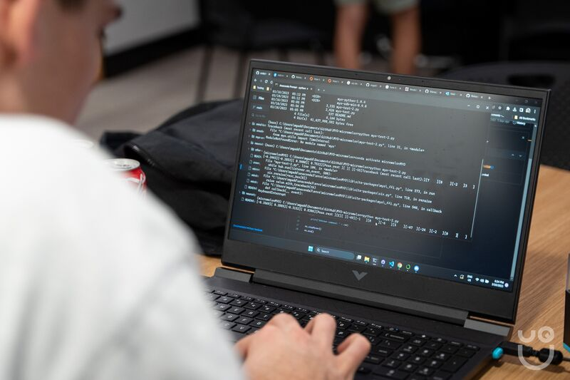
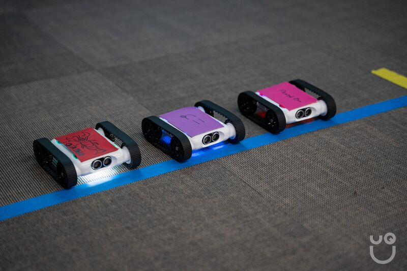
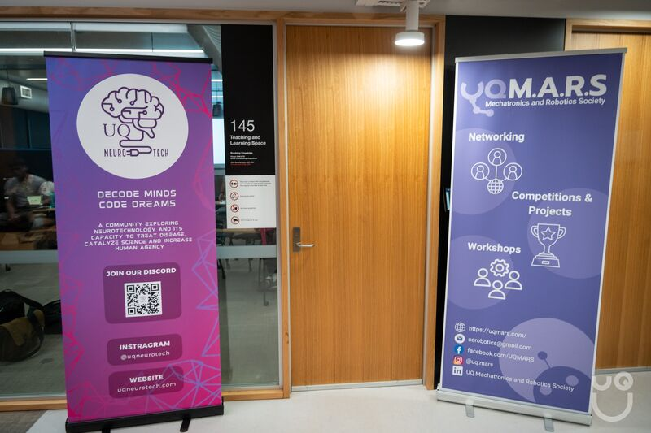
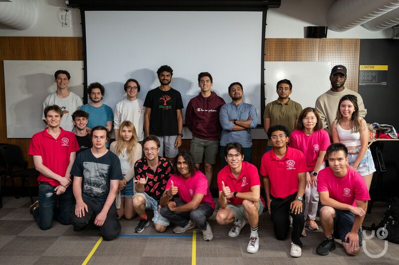

# UQ NeuroTech Mind-Bot race.

**PREFACE: This was written at a time before AI completely destroyed the joys of manually writing code - no, genuinely.**

- connect.py
- main.py

This repo showcases the files I authored for the UQ NeuroTech club's flagship event, the mind-bot race.

When I was first introduced to this concept, my friend Seijun Stokes told me "Basically, we're going to get a bunch of EEG headsets, put them on our head and then race robots with them". As childishly epic as that sounds, I am pleased to say that for the past two years we have managed to achieve just that.

Personally, one of my favourite moments from this event was watching one of the participants effortlessly twist their hand to cause the robot cars to turn left and right; It was like watching the force in action! 

To run this, you will need:
- A EMOTIV Cortex BrainWear device (the application is built around interfacing with their proprietary software)
- EMOTIV Cortex API & Brainwear App (there are built in simulators to do a dry-run)
- Python (`pip install -r requirements.txt` and then run `main.py`)

*Note - Don't forget to write a .env file and put your `APP_CLIENT_ID` and `APP_SECRET_KEY` in it if you do run it for whatever reason - don't put client secrets in files, dummy!*

If this idea also sounds epic to you I highly recommend you give it a go :D

